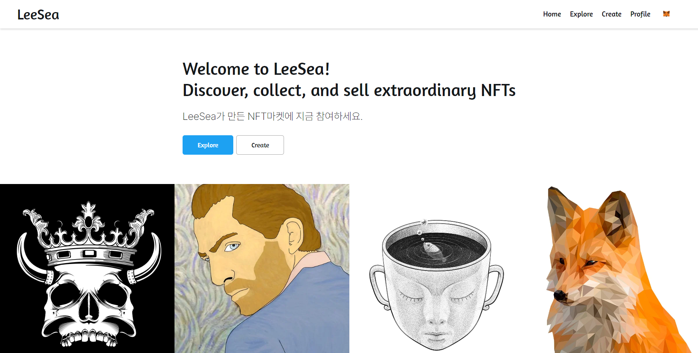
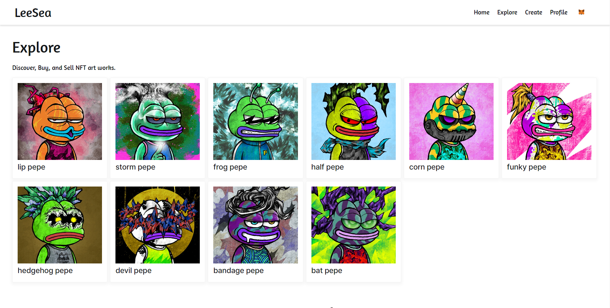
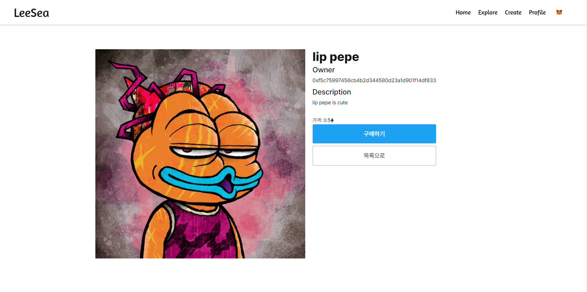
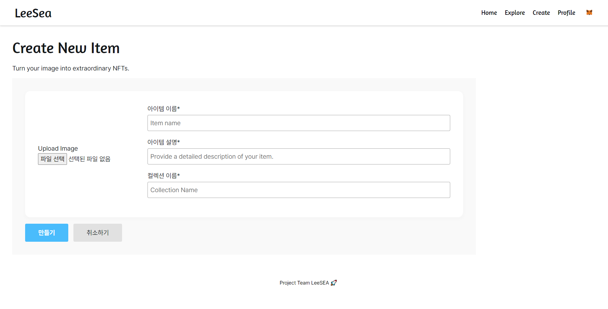
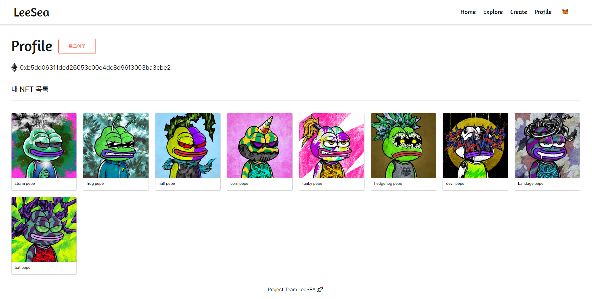
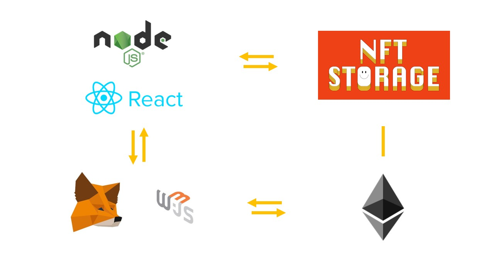

# LeeSea

NFT를 민팅하고 거래할 수 있는 플랫폼

- [LeeSea 사이트](https://codestates.github.io/BEB-05-LeeSea)
- [Notion 페이지](#)
- 프로젝트 기간: 2022.08.08 ~ 2022.08.16


## 🍁 주요 기능

- Minting: 자신의 이미지 파일을 NFT로 제작
- Collection: 자신이 소유하고 있는 NFT 컬렉션 확인
- Marketplace: 플랫폼에서 다른 사용자의 NFT를 확인하고 거래


## 📑 페이지

1. Home: 메인 페이지이다.
    
2. Explore: 등록된 NFT 작품을 탐색할 수 있다.
    
3. TokenDetail: NFT 작품의 상세 정보를 확인하고 거래를 할 수 있다.
    
4. Create: 이미지를 NFT로 민팅할 수 있다.
    
5. Profile: 현재 계정의 정보와 소유한 NFT 작품을 확인할 수 있다.
    


## ⚙️ 기술 스택



- 프론트엔드: React, node.js, SCSS
- 블록체인: Etehreum(Rinkeby Testnet), Ganache
- 기타: web3.js, NFT Storage, MetaMask


## 📕 작동 구조

- Remix IDE를 통해 Ethereum 컨트랙트를 배포
- web3.js를 통해 React 프로젝트에서 Ethereum 블록체인과 통신
- `NFT Storage`를 통해 IPFS에 NFT의 metadata를 저장 및 통신
- Chorme MetaMask 플러그인을 통해 지갑 연결
- redux를 활용한 데이터 상태 관리


## 🌵 설치 및 사용

`client` 폴더로 들어가서 react 프로젝트를 확인한다.

1. 먼저 환경변수를 설정해준다.

    `client` 폴더 하위에 `.env` 파일을 생성하고 아래 코드를 입력한다. `REACT_APP_NFT_STORAGE_API_KEY`에는 NFT STORAGE에서 발급한 API 키를 넣어준다.

    ```
    SKIP_PREFLIGHT_CHECK=true
    REACT_APP_SKIP_PREFLIGHT_CHECK=true
    REACT_APP_USE_GANACHE=false
    REACT_APP_NFT_STORAGE_API_KEY=NFT STORAGE API 키
    REACT_APP_CONTRACT_ADDR=0x2e03ef77518f0ddeb042ab3de778a64737a983ea
    ```

2. npm install 명령어를 통해 모듈을 설치한다.

    ```bash
    npm install
    ```

3. 프로젝트를 실행한다.

    ```bash
    npm start
    ```

4. Chorme 브라우저를 통해 페이지에 접속한다.


## 🥕 팀원

이성만 [@sungman5](https://github.com/sungman5)
이송영 [@SongArtish](https://github.com/SongArtish)
이혜인 [@hyenne](https://github.com/hyenne)
이휘준 [@LEEHWIJOON](https://github.com/LEEHWIJOON)